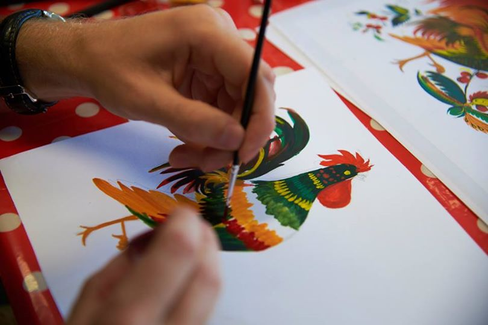

Title: Петриківський розпис
Date: 2015-10-14 22:20
Tags: Для всіх груп
Category: Художня майстерня
Slug: my-super-post
Summary: перший майстер-клас

Після надзвичайного успіху майстер-класів з Петриківського розпису з майстром Яною Іванніковою та на велике прохання української громади відтепер Петріківський розпис і Яна в Амстердамі в стінах нашої української школи.

Щиро запрошуємо всіх бажаючих віком 12+ на перший майстер-клас, який відбудеться 17 жовтня.
В рамках культурної акції Ви зможете дізнатися про історію цього старовинного виду українського народного мистецтва та створити свої перші власні мальованки.
Для досвідчених петриківчан у нас буде окрема програма на самому майстер-класі.

Реєстрація для участі у майстер-класі є ОБОВ'ЯЗКОВОЮ.
Здійснити реєстрацію Ви можете, надіславши приватне повідомлення майстру — Яні Іванніковій [на її сторінці в ФБ](https://www.facebook.com/yana.ivannikova.3)

Дата проведення: 17 жовтня 2015р (субота)
Час проведення: 17:00-19:00
Вартість: 25 євро
Для родини: перший член родини — 25 євро, наступні — 20 євро
Вікова категорія: 12+
Мова майстер-класу: українська

Ласкаво просимо!!!!

На днях в дружньому нам українському культурному центрі "Вулик" в Ейндховені пройшов майстер-клас з Петриківського розпису з Яною Іванніковою.

Запрошуємо вас повторити та продовжити приємні почуття від поринання у творіння своїх петриківських візерунків на нашому майстер-класі з Петриківки в Українській школі м.Амстердам.

